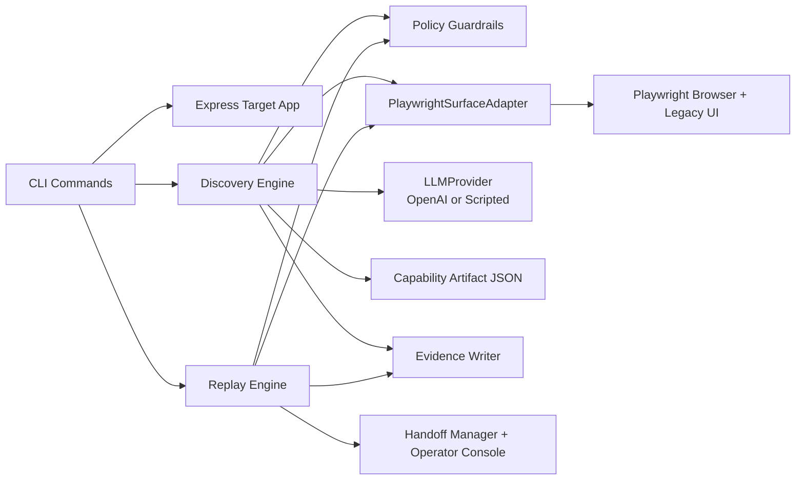

# Computer-Use Automation System

A thin but real TypeScript take-home implementation of LLM-guided browser discovery, typed capability artifacts, deterministic replay, safety guardrails, evidence capture, and same-session human handoff against a synthetic local credit-union app.

## Project overview

The repository contains:

- a local legacy-style Express target app with an iframe-based servicing flow and deterministic synthetic scenarios
- a `PlaywrightSurfaceAdapter` that observes and operates the live browser surface
- a discovery loop that requests one validated structured action at a time from an `LLMProvider`
- a typed, versioned capability artifact schema validated by Zod
- a deterministic replay engine that never calls the LLM
- policy enforcement, redaction, evidence capture, and human-handoff support

## Architecture diagram



## Prerequisites

- Node.js 20+
- npm
- Chromium installed through Playwright

## Installation

```bash
npm install
npx playwright install chromium
```

## Environment configuration

Copy `.env.example` if desired. Only live discovery needs an API key.

```bash
OPENAI_API_KEY=...
OPENAI_MODEL=gpt-5-mini
PORT=3000
```

## Exact commands

Start the local target app:

```bash
npm run dev:target
```

Run live LLM discovery:

```bash
npm run discover -- --goal "Look up member 12345 and return the current savings balance" --target http://127.0.0.1:3000 --input memberId=12345
```

Run deterministic replay:

```bash
npm run replay -- --artifact artifacts/member-balance.v1.json --input memberId=12345 --target http://127.0.0.1:3000
```

Run the offline scripted demo:

```bash
npm run demo
```

Run the headed handoff demo:

```bash
npm run demo:headed
```

Generate live evidence after exporting `OPENAI_API_KEY`:

```bash
OPENAI_API_KEY=your_key_here npm run evidence:live
```

Quality checks:

```bash
npm test
npm run test:integration
npm run typecheck
npm run lint
npm run format
```

## Five-minute demonstration path

1. `npm install`
2. `npx playwright install chromium`
3. `npm run demo`
4. Inspect `artifacts/member-balance.v1.json`
5. Inspect `evidence/discovery/`, `evidence/replay-success/`, `evidence/replay-business-outcome/`, and `evidence/handoff/`
6. Optionally run `npm run demo:headed` and open the tokenized operator URL printed by the CLI

## Human handoff instructions

1. Run `npm run demo:headed`.
2. Wait for the browser to pause on the synthetic review page.
3. Open the exact operator-console URL printed in the terminal.
4. Claim the intervention, inspect the same live Playwright session, then resume or abort.
5. Review `evidence/handoff/` for the shared correlation ID, intervention record, and sanitized audit trail.

## Live mode vs scripted test mode

- **Live mode** uses `OpenAILLMProvider` and requires `OPENAI_API_KEY`.
- **Scripted test mode** uses `ScriptedLLMProvider` for offline tests and demonstrations.
- The committed evidence is intentionally marked `mode: scripted-test`; it is not presented as genuine live-model evidence.
- `evidence/README.md` contains the exact single command the final submitter should run after setup to generate live discovery evidence.

## Artifact example

`artifacts/member-balance.v1.json` is a readable discovered artifact for member-balance lookup. It contains:

- schema version and checksum
- typed input `memberId`
- typed output `savingsBalance`
- stable locator bundles with accessibility-first priority
- checkpoints and business-outcome detection
- tenant-neutral defaults and override metadata

## Result examples

Successful replay result:

```json
{
  "status": "success",
  "outputs": {
    "savingsBalance": "$1,234.56"
  }
}
```

Business outcome result:

```json
{
  "status": "business_outcome",
  "code": "MEMBER_NOT_FOUND",
  "message": "Member was not found in synthetic application."
}
```

## Safety warning

This project automates a synthetic local application only. The policy blocks off-allowlist navigation, sensitive-field entry, and irreversible confirmation steps unless a human explicitly approves them.

## Troubleshooting

- If Chromium is missing, run `npx playwright install chromium`.
- If live discovery fails immediately, verify `OPENAI_API_KEY`.
- If replay fails checksum validation, regenerate the artifact via discovery or the demo.
- If headed handoff seems paused, open the tokenized operator console URL printed by the CLI and resolve the intervention.

## Repository structure

```text
artifacts/        Versioned capability artifacts
coverage/         Test coverage output when generated
evidence/         Scripted demo evidence and live-evidence instructions
src/
  core/           Schemas, checksum, policy, redaction, defaults
  providers/      OpenAI and scripted LLM providers
  runtime/        Handoff manager and operator routes
  surface/        Playwright surface adapter
  target/         Synthetic legacy credit-union app
tests/
  integration/    Replay and handoff integration tests
  unit/           Policy, redaction, checksum, locator tests
```

## Known limitations

- Discovery is intentionally thin and optimized for the included vertical slice rather than broad general web autonomy.
- The committed handoff evidence uses a simulated operator acting through the same Playwright context in headless mode; real headed control is available through `npm run demo:headed`.
- The browser-side audit hook is minimal and focuses on sanitized clicks, navigation, and field interaction rather than full trace capture.
- No desktop adapter is implemented yet, but the artifact contract is surface-agnostic.
